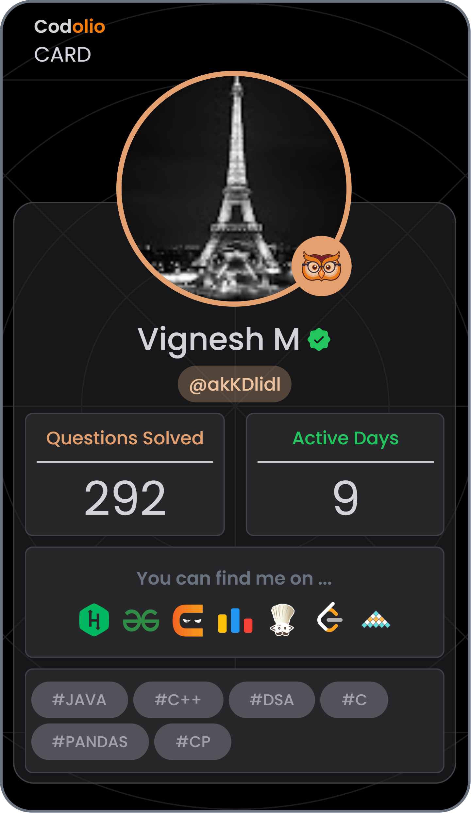
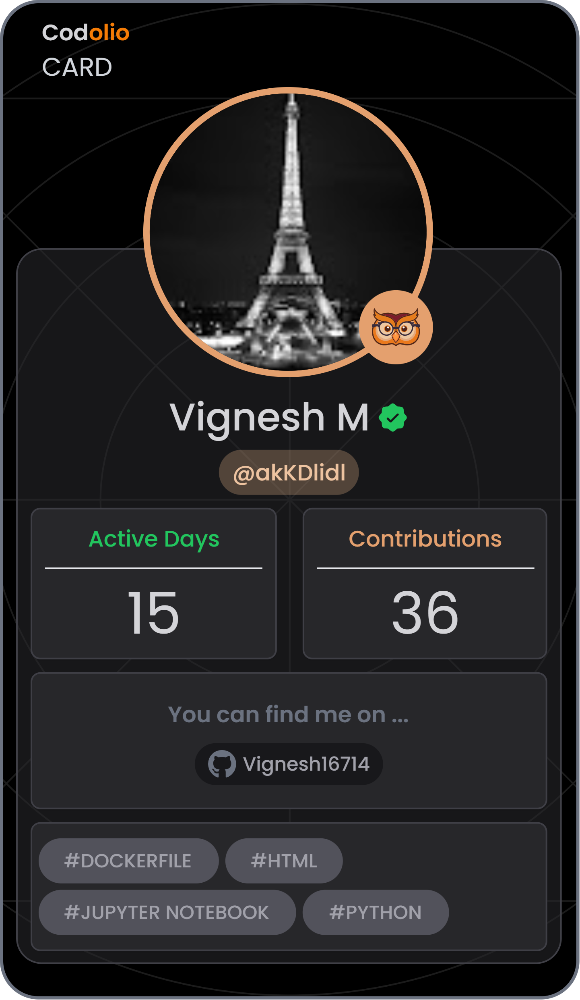

<!--
  ============================================================
  README.md — GitHub Profile
  Owner: Ponvigneshwaran
  ============================================================
  HOW TO USE THIS FILE
  1. Create a new repository named EXACTLY your GitHub username:
       Vignesh16714
     GitHub will automatically treat this repo's README as your profile README.
  2. All personal details are filled in: GitHub (Vignesh16714), LinkedIn,
     LeetCode (im_vignesh16), email, portfolio, and 3 project cards
     (Portfolio Website, Predictive Maintenance System, Cloud Data Pipeline).
     Nothing left to replace — just copy this file in as-is.
  3. Some widgets (GitHub Stats, Streak, Trophies, Activity Graph, LeetCode card)
     are powered by third-party open-source APIs (github-readme-stats,
     github-readme-streak-stats, github-readme-activity-graph,
     github-profile-trophy, leetcode-stats-card). They work automatically
     once you swap in your username — no server setup needed.
  4. The contribution snake animation requires a one-time GitHub Actions
     setup — instructions are in the comment above that section.
  ============================================================
-->

<div align="center">

<!-- ===================== HERO BANNER ===================== -->


<!-- ===================== ANIMATED TYPING BANNER ===================== -->
<a href="#">
  
</a>

<br/>

<!-- ===================== SOCIAL BADGES ===================== -->
<!-- REPLACE all placeholders below with your real handles -->
<p>
  <a href="https://www.linkedin.com/in/ponvigneshwaran-m-13222b326/" target="_blank">
    
  </a>
  <a href="https://github.com/Vignesh16714" target="_blank">
    
  </a>
  <a href="https://ponvigneshwaran.vercel.app" target="_blank">
    
  </a>
  <a href="mailto:ponvigneshw@gmail.com" target="_blank">
    
  </a>
  <a href="https://leetcode.com/u/im_vignesh16/" target="_blank">
    
  </a>
</p>

<!-- ===================== VISITOR COUNTER ===================== -->


</div>

<br/>


<!-- ===================== ABOUT ME ===================== -->
## 🧠 About Me

<!-- Decorative gif removed (old hotlink was broken/removed by the source).
     Want one back? Download any coding gif, save it inside this repo as
     assets/coding.gif, then use:
      -->

```yaml
whoami:
  name: "Ponvigneshwaran"
  role: "CSBS Student | Full Stack Developer | Problem Solver"
  location: "India 🇮🇳"
  currently_focused_on:
    - Data Structures & Algorithms
    - Full Stack Web Development
    - Placement Preparation
  interested_in:
    - Web Development 🌐
    - Software Engineering 💻
    - Artificial Intelligence 🤖
    - Cloud Computing ☁️
  status: "Open to Internships & Collaborations 🤝"
  fun_fact: "I debug with print statements and I'm not ashamed of it 😄"
```

- 🔭 Currently sharpening my skills in **DSA** and **Full Stack Development**
- 🌱 Preparing hard for **campus placements & tech interviews**
- 💡 Passionate about building **scalable, real-world web applications**
- 🤝 Open to **internships, freelance gigs, and open-source collaborations**
- ⚡ Fun fact: I once spent 3 hours debugging code — the bug was a missing semicolon

<br clear="right"/>


<!-- ===================== TECH STACK ===================== -->
## 🛠️ Tech Stack

<div align="center">

### Languages


### Frontend


### Backend & Database


### Tools & Platforms


</div>


<!-- ===================== GITHUB ANALYTICS ===================== -->
## 📊 GitHub Analytics

<div align="center">


<br/>


<br/><br/>


<br/><br/>

### 🏆 GitHub Trophies


</div>


<!-- ===================== CODING PROGRESS ===================== -->
## 🧩 Coding Progress

<div align="center">

<!--
  UNIFIED STATS CARD — powered by dsastats.vercel.app, which pulls live data
  directly from your Codolio profile (aggregating LeetCode, GeeksforGeeks,
  CodeChef, Codeforces, InterviewBit, HackerRank, etc. into one card).
  Your Codolio username (from codolio.com/profile/akKDlidl) is: akKDlidl
  This card updates automatically whenever your Codolio profile updates —
  no manual edits needed.
-->
<!--
  UNIFIED STATS — using your actual downloaded Codolio cards (devCard.png and
  profileCard.png), hosted inside this repo's root so they load reliably and
  don't depend on any third-party server being up.

  NOTE: These are static snapshots, not live-updating. Whenever your Codolio
  stats change and you want a fresh card, go back to your Codolio profile,
  click "Get your Codolio Card", download the new PNGs, and re-upload them to
  this repo with the SAME filenames (devCard.png / profileCard.png) to
  overwrite them — no need to edit this README again.
-->
<table>
<tr>
<td align="center"></td>
<td align="center"></td>
</tr>
</table>

<br/>

<a href="https://codolio.com/profile/akKDlidl" target="_blank">
  
</a>

<p><i>👆 Live combined stats across every platform I code on — click for the full interactive dashboard.</i></p>

<br/>

### Platforms I'm Active On

<a href="https://leetcode.com/u/im_vignesh16/" target="_blank">
  
</a>
<a href="https://www.geeksforgeeks.org/profile/ponvigipbc" target="_blank">
  
</a>
<a href="https://www.codechef.com/users/pvw_16" target="_blank">
  
</a>
<a href="https://codeforces.com/profile/Vignesh161006" target="_blank">
  
</a>
<a href="https://www.interviewbit.com/profile/vignesh-m_403/" target="_blank">
  
</a>
<a href="https://www.naukri.com/code360/profile/MadJack" target="_blank">
  
</a>

<br/><br/>

<details>
<summary><b>📌 LeetCode Detail Card (click to expand)</b></summary>

<br/>


<br/><br/>

<!-- Dynamic LeetCode heatmap card -->


</details>

</div>


<!-- ===================== FEATURED PROJECTS ===================== -->
## 🚀 Featured Projects

<div align="center">

<table width="100%">
<tr>
<td width="50%" valign="top">

### 🌐 Portfolio Website (Full Stack)
End-to-end portfolio website built with a full-stack architecture, leveraging AWS cloud services for hosting, scalability, and deployment. Showcases projects, skills, and achievements with a modern, responsive design.

**Tech Stack:**
`Full Stack` `AWS` `Cloud Hosting`

<a href="https://ponvigneshwaran.vercel.app" target="_blank"></a>
<a href="https://github.com/Vignesh16714/portfolio-fullstack" target="_blank"></a>

</td>
<td width="50%" valign="top">

### 🛠️ Predictive Maintenance System
IoT sensor-based predictive maintenance analysis using PySpark and XGBoost, with insights visualized through Power BI dashboards.

**Tech Stack:**
`PySpark` `XGBoost` `Power BI` `IoT`

<a href="https://github.com/Vignesh16714/Predictive-Maintenance-System" target="_blank"></a>

</td>
</tr>
<tr>
<td colspan="2" align="center" valign="top">

### ☁️ Cloud Data Pipeline
Cloud-deployed AI pipeline built using AWS S3, Lambda, Docker and Kubernetes for scalable, automated data processing.

**Tech Stack:**
`AWS S3` `AWS Lambda` `Docker` `Kubernetes`

<a href="https://github.com/Vignesh16714/cloud-data-pipeline" target="_blank"></a>

</td>
</tr>
</table>

</div>


<!-- ===================== ACHIEVEMENTS ===================== -->
## 🏅 Achievements

<div align="center">


</div>


<!-- ===================== CODING ACTIVITY ===================== -->
## 📈 Coding Activity

<!--
  SNAKE ANIMATION SETUP (one-time):
  1. In your profile repo, create: .github/workflows/snake.yml
  2. Paste this workflow:

     name: Generate Snake
     on:
       schedule:
         - cron: "0 0 * * *"
       workflow_dispatch:
       push:
         branches: [ main ]
     jobs:
       generate:
         runs-on: ubuntu-latest
         permissions:
           contents: write
         steps:
           - uses: Platane/snk/svg-only@v3
             with:
               github_user_name: Vignesh16714
               outputs: |
                 dist/github-contribution-grid-snake.svg
                 dist/github-contribution-grid-snake-dark.svg?palette=github-dark
           - uses: crazy-max/ghaction-github-pages@v4
             with:
               target_branch: output
               build_dir: dist
             env:
               GITHUB_TOKEN: ${{ secrets.GITHUB_TOKEN }}

  3. Push once, let the Action run, then it auto-updates daily.
-->

<div align="center">


<br/><br/>


</div>


<!-- ===================== CONNECT ===================== -->
## 🤝 Connect With Me

<div align="center">

<a href="https://www.linkedin.com/in/ponvigneshwaran-m-13222b326/" target="_blank">
  
</a>
<a href="https://github.com/Vignesh16714" target="_blank">
  
</a>
<a href="https://ponvigneshwaran.vercel.app" target="_blank">
  
</a>
<a href="mailto:ponvigneshw@gmail.com" target="_blank">
  
</a>

</div>


<!-- ===================== FOOTER ===================== -->
<div align="center">

### 💭 *"Code is like humor. When you have to explain it, it's bad."*
**— Cory House**

<br/>


**Thanks for stopping by! ⭐ Star some repos, drop a follow, and let's build something great together.**

</div>
